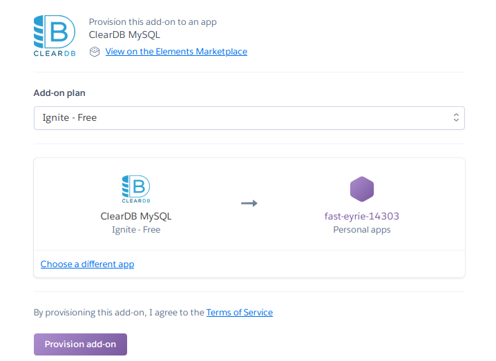

# Random Workout Generator

Helidon MP project that includes REST operations to obtain exercises from a MySQL database.

[React frontend repository](https://github.com/barrysweeney/workout-app-react) and [live site](https://random-workout-generator.netlify.app/).

## Build and run

```bash
docker-compose up
```

## Exercise the application

```
curl -X GET http://localhost:8080/workout
{
    "name":"Generated Workout",
    "exercises":["Pullups","Flutter Kicks","Lunge","Plank knees to elbows","Burpees","Single Arm Swings","Reverse Crunch","Pushups","Plank","Wide Pushups"]
}

curl -X GET http://localhost:8080/workout?type=arms,back&limit=3
{
    "name":"Generated Workout",
    "exercises":["Superman Hold","Curls","Rows"]
}
```


## Deploying to Heroku
For more information see the [Heroku Dev Center Documentation](https://devcenter.heroku.com/articles/container-registry-and-runtime)

In the Dockerfile, change the CMD to
```text
CMD java -Dserver.port=$PORT -jar helidon-quickstart-mp.jar
```
Log in to Container Registry:
```bash
heroku container:login
```
Create a Heroku app:
```bash
heroku create
```
Note that commands after this may need suffixed with --app <app-name> where <app-name> is the Heroku provided name.

Build the image:
```bash
docker build -t helidon-quickstart-mp .
```
Push to Container Registry:
```bash
heroku container:push web
```
Release image to your app:
```bash
heroku container:release web
```
Open the app in your browser
```bash
heroku open
```

Note that there are [command line tools to provision the MySQL add-on](https://devcenter.heroku.com/articles/cleardb).

Provision [ClearDB MySQL add-on](https://elements.heroku.com/addons/cleardb) from the Heroku dashboard:


Retrieve database URL:
```bash
heroku config | grep CLEARDB_DATABASE_URL
```

Copy this URL to microprofile-config.properties filling in the generated username, password, and database name:

```properties
javax.sql.DataSource.example.dataSourceClassName=com.mysql.cj.jdbc.MysqlDataSource
javax.sql.DataSource.example.dataSource.url=jdbc:mysql://<username>:<password>@us-cdbr-east-02.cleardb.com/<heroku_db>?reconnect=true
javax.sql.DataSource.example.dataSource.user=<username>
javax.sql.DataSource.example.dataSource.password=<password>
```

Note that if you have another frontend you can add it like so:
```properties
cors.paths.0.allow-origins = https://random-workout-generator.netlify.app
```

To populate the database you could use a tool like [MySQL Workbench](https://www.mysql.com/products/workbench/).

You can connect using the same credentials from microprofile-config.properties.

You can use the [init_script.sql](src/main/resources/META-INF/init_script.sql) to create the schema and populate the tables.

To query the database all references to `workout.exercises` in WorkoutResource.java should be changed to `<heroku_db>.exercises`

Finally, to deploy to Heroku, you can use the same commands listed above.

## How the initial SQL Dump was created

### Connect to MySQL
```bash
docker container run --rm -d -p 3306:3306 \
    --env MYSQL_ROOT_PASSWORD=password \
    --name mysql \
    mysql:8
```

### Run MySQL commands inside container
```bash
docker exec -it mysql bash
mysql -p
```

### Paste initialization script

[init_script.sql](src/main/resources/META-INF/init_script.sql)

### Create SQL dump

```bash
mysqldump -p --databases workout > dump.sql
```

### Move dump out of container
```bash
cat dump.sql
```
Copy and paste into `/docker/data/dump.sql`